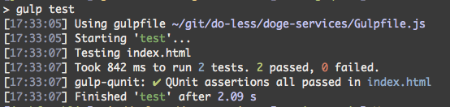

# [gulp](https://github.com/gulpjs/gulp)-qunit [](https://travis-ci.org/jonkemp/gulp-qunit)

[](https://nodei.co/npm/gulp-qunit/)

> Run QUnit unit tests in a headless PhantomJS instance.

Run QUnit unit tests in a PhantomJS-powered headless test runner, providing basic console output for QUnit tests. Uses the [phantomjs](https://github.com/Medium/phantomjs) node module and the [PhantomJS Runner QUnit Plugin](https://github.com/jonkemp/qunit-phantomjs-runner).

Inspired by the grunt plugin [grunt-contrib-qunit](https://github.com/gruntjs/grunt-contrib-qunit).



## Install

Install with [npm](https://npmjs.org/package/gulp-qunit)

```bash
$ npm install --save-dev gulp-qunit
```

## Usage

```js
var gulp = require('gulp'),
    qunit = require('gulp-qunit');

gulp.task('test', function() {
    return gulp.src('./qunit/test-runner.html')
        .pipe(qunit());
});
```

With options:

```js
var gulp = require('gulp'),
    qunit = require('gulp-qunit');

gulp.task('test', function() {
    return gulp.src('./qunit/test-runner.html')
        .pipe(qunit({'phantomjs-options': ['--ssl-protocol=any']}));
});
```

You no longer need this plugin to run QUnit tests in your gulp tasks. Now you can do this with [node-qunit-phantomjs](https://github.com/jonkemp/node-qunit-phantomjs), a stand alone module. It can also be used via command line, and it has an option for more verbose test reporting.
```js
var gulp = require('gulp'),
    qunit = require('node-qunit-phantomjs');

gulp.task('test', function() {
    qunit('./qunit/test-runner.html');
});
```

With phantomjs2:

```js
var gulp = require('gulp'),
    qunit = require('gulp-qunit');

gulp.task('test', function() {
    return gulp.src('./qunit/test-runner.html')
        .pipe(qunit({'binPath': require('phantomjs2').path}));
});
```

## API

### qunit(options)

#### options.timeout

Type: `Number`  
Default: `5`

Pass a number or string value to override the default timeout of 5 seconds.

#### options.phantomjs-options

Type: `Array`  
Default: `None`

These options are passed on to PhantomJS. See the [PhantomJS documentation](http://phantomjs.org/api/command-line.html) for more information.

#### options.binPath

Type: `String`
Default: require("phantomjs").path

The option is used to execute phantomjs binary path

## License

MIT © [Jonathan Kemp](http://jonkemp.com)
